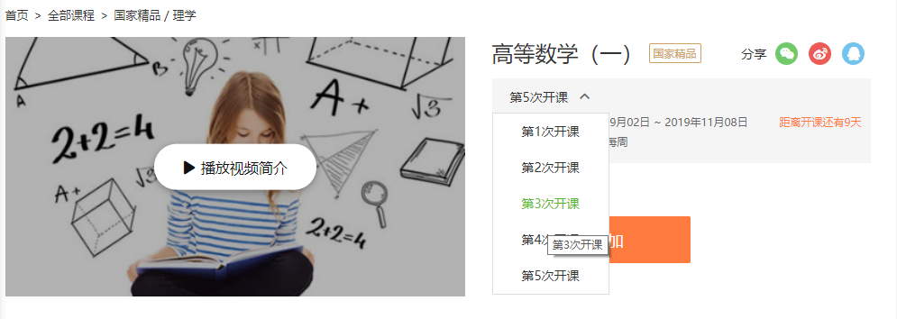

# 中国大学 MOOC

## 简介

[中国大学 MOOC](https://www.icourse163.org/) 是国内优质的中文 MOOC 学习平台，由爱课程网携手·网易云课堂·打造。**大多数的名校都有一定数量课程**，如北京大学、浙江大学、哈尔滨工业大学等

## 地址格式

课程的地址必须类似以下两种格式

```
https://www.icourse163.org/course/TONGJI-53004
https://www.icourse163.org/course/TONGJI-53004?tid=1001770008
```

::: tip

-  上面的 `course` 替换为 `learn` 也是支持的
-  `SPOC` 课程也是支持的，比如 `https://www.icourse163.org/spoc/course/WHUT-1002745006?tid=1002931006`
   :::

## 开课次数

课程的地址包含了两部分信息，以 `https://www.icourse163.org/course/TONGJI-53004?tid=1001770008` 为例，`53004` 是课程号，唯一标志了同济大学开设的高等数学（一）这门课程，而 `1001770008` 代表了某学期的该课程的课程号，如果地址中不出现 `?tid=xxx` 字段，则默认为最新一次开课，所以我们可以通过控制最后的 `tid` 以达到下载不同学期的课件，而不同学期的地址我们可以在课程主页获取



切换开课学期后便可在浏览器地址栏看到对应的学期课程地址

## 身份验证

中 M 的视频接口很不稳定，在这一年内进行了多次的变更，当前有两种内置的方案

-  一种是在程序要求输入 Cookies 的时候直接回车注入空的 Cookies 以调用旧接口，但不保证该接口以后会不会删掉
-  另一种输入完整的 Cookies ，这样会调用新的接口，但是最近（19 年 10 月），该接口只会返回新视频的 m3u8 播放列表，如果遇到该问题，请使用旧接口进行下载，问题详细描述见 [issue37](https://github.com/Foair/course-crawler/issues/37)，如果该方案也无法解决，请临时使用 [mooc-dl](https://github.com/SigureMo/mooc-dl) 或者自行寻求其他解决方案

## 碎碎念

「老师已关闭该学期，无法查看」暂时无所畏惧。

找不到开课页面的话，可以先进入课程的公告页面，然后点击课程名。

如果你下载的是最新学期的课程，请**确定最新学期已经开课**，未开课的学期是无法下载的，不过你可以尝试下载前几个学期的课程。
