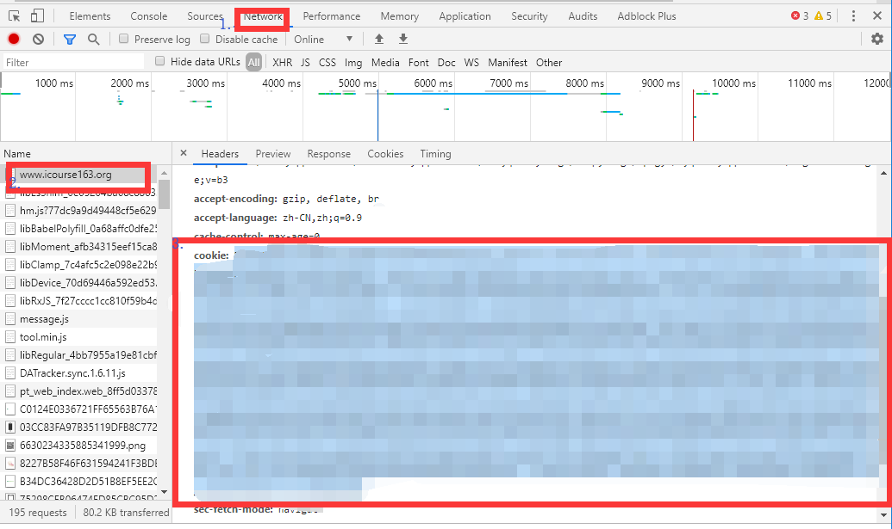

# 快速开始

<bilibili-player avid=65418448></bilibili-player>

## 准备工作

在下载之前，你需要保证你已经安装 `python3.5` 及其以上版本，并且安装完成依赖

需要的依赖如下

-  `requests`
-  `BeautifulSoup4`
-  `lxml`
-  `pycryptodome`

```bash
pip install requests BeautifulSoup4 lxml pycryptodome
```

## 下载程序源码

前往项目主页下载程序，或者直接点击[这里](https://github.com/SigureMo/course-crawler/archive/master.zip)，之后解压

当然，已经安装 `git` 的同学可以直接 `clone`

```bash
git clone https://github.com/SigureMo/course-crawler.git
```

## 运行程序

在刚刚下载的项目根目录下打开命令行（“终端”、“命令提示符”、“PowerShell”都行，`Win10` 在项目根目录按住 `shift` 右键就有相应的选项，后面统称命令行）

在命令行中输入 `python mooc.py <url>` ，即可将课程课件下载到当前文件夹

比如，中国大学 MOOC 课程 `《高等数学（一）》 - 同济大学`

```bash
python mooc.py https://www.icourse163.org/course/TONGJI-53004
```

::: tip
这里的 `<url>` 为课程主页的地址，网址的具体要求及课程下载的额外要求详见[分类](../courses/icourse163.md)
:::

## 身份验证

很多课程并不是直接就能下载的，需要验证下你的身份，这大多都可以通过输入 Cookies 解决

当你下载的课程需要输入 Cookies 时，用浏览器打开课程主页，然后按下 `F12` 打开开发者工具

切换到 `Network` 选项卡，刷新页面，在左侧选择第一个抓到的包，在右侧 `Headers` 中找到 `cookie` （也可能是 `Cookie`），复制粘贴到程序命令行中



::: tip

如果你和我一样懒的话，可以直接三击 cookies 快速将整个 cookies 及前面的 `cookie:` 一起选中，直接复制粘贴到程序中，也是可以的，反正我是懒得从左上滑到右下啦，所以特意做了这个小“优化”~

:::

## 等待 ...

等待程序运行，程序首先会从课程主页获取课件列表及解析所需相关信息，之后逐个课件进行解析下载

## 下载视频

特别地，由于视频资源相对来说花费时间较多，所以视频资源并不是在解析时直接进行下载，而是解析出 `url` 至 `<course>/Videos/Videos.txt` ，之后需要你自行使用下载工具进行下载（比如 `aria2` ，或者迅雷等）

下载后将视频移动到 `<course>/Videos/` 内，之后双击 `Rename.bat` 即可修正视频名

::: tip

-  这里的 `<course>` 指课程根目录
-  Linux 下的使用以及 `Rename` 文件详情请见[视频文件名](basic.html#视频文件名)

:::

## 视频的播放

使用 PotPlayer 打开 `Playlist.dpl` 即可播放视频

::: tip

如果你并不想使用 PotPlayer ，请修改[播放列表设置](../advance/cli.html#播放列表设置)

:::
